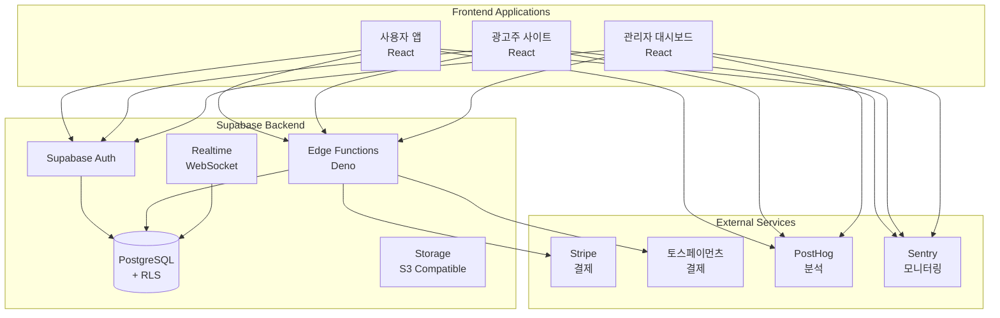

# Treit 시스템 아키텍처

## 📐 아키텍처 개요

Treit은 **서버리스 마이크로서비스 아키텍처**를 채택하여 확장성, 유지보수성, 비용 효율성을 극대화합니다.



## 🏛️ 핵심 설계 원칙

### 1. **Serverless First**
- 인프라 관리 최소화
- 자동 스케일링
- 사용한 만큼만 비용 지불

### 2. **Security by Design**
- Row Level Security (RLS)
- JWT 기반 인증
- 최소 권한 원칙

### 3. **Real-time by Default**
- WebSocket 기반 실시간 업데이트
- 이벤트 기반 아키텍처
- 낙관적 UI 업데이트

### 4. **Type Safety**
- TypeScript 전면 적용
- Zod 스키마 검증
- 자동 타입 생성

## 🔧 기술 스택 상세

### Frontend Layer

#### 공통 기술
- **React 18**: 최신 React 기능 활용
- **TypeScript 5**: 타입 안정성
- **Tailwind CSS**: 유틸리티 기반 스타일링
- **Shadcn/UI**: 재사용 가능한 컴포넌트
- **Vite**: 빠른 빌드 도구
- **React Query**: 서버 상태 관리
- **Zustand**: 클라이언트 상태 관리

#### 앱별 특징
| 앱 | 특징 | 주요 라이브러리 |
|----|------|----------------|
| 사용자 앱 | 모바일 최적화 | React Spring (애니메이션) |
| 광고주 사이트 | 대시보드 중심 | Recharts (차트) |
| 관리자 대시보드 | 실시간 모니터링 | React Table (테이블) |

### Backend Layer (Supabase)

#### Database (PostgreSQL)
```sql
-- 주요 특징
- UUID 기본 키
- JSONB 타입 활용
- Generated Columns
- Materialized Views
- Partitioning (click_events)
```

#### Row Level Security (RLS)
```sql
-- 모든 테이블에 RLS 적용
ALTER TABLE table_name ENABLE ROW LEVEL SECURITY;

-- 정책 예시
CREATE POLICY "Users can view own data" ON users
FOR SELECT USING (auth.uid() = auth_uid);
```

#### Edge Functions
```typescript
// Deno 런타임 사용
// 주요 함수들:
- tracking-click     // 클릭 추적
- matching-join      // 캠페인 참여
- process-payment    // 결제 처리
- calculate-earnings // 수익 계산
- detect-fraud       // 어뷰징 감지
```

#### Realtime Subscriptions
```typescript
// 실시간 구독 채널
- clicks:campaign_id    // 캠페인별 클릭
- earnings:user_id      // 사용자 수익
- dashboard:admin       // 관리자 대시보드
```

## 📊 데이터 플로우

### 1. 사용자 플로우
```
사용자 로그인 → 캠페인 조회 → 템플릿 복사 → SNS 공유
    ↓
외부 클릭 → Edge Function 처리 → 클릭 검증 → DB 저장
    ↓
실시간 업데이트 → 수익 계산 → 사용자 알림
```

### 2. 광고주 플로우
```
광고주 로그인 → 캠페인 생성 → 예산 설정 → 템플릿 업로드
    ↓
관리자 승인 → 캠페인 활성화 → 실시간 모니터링
    ↓
자동 정산 → 리포트 생성
```

### 3. 클릭 추적 플로우
```
클릭 발생 → CDN Edge → Edge Function
    ↓
검증 로직:
- IP 중복 체크
- 시간 간격 체크
- User Agent 검증
- Referrer 확인
    ↓
유효 클릭 → DB 저장 → 실시간 브로드캐스트
```

## 🔐 보안 아키텍처

### 인증 & 권한

#### 사용자 타입별 권한
| 타입 | 권한 | 접근 가능 영역 |
|-----|------|---------------|
| User | READ, CREATE (own) | 캠페인 조회, 참여 |
| Business | CRUD (own) | 캠페인 관리, 분석 |
| Admin | READ all | 모니터링, 승인 |
| Super Admin | CRUD all | 전체 시스템 |

#### JWT Claims 구조
```json
{
  "sub": "user_uuid",
  "role": "user|business|admin",
  "permissions": ["read", "write"],
  "exp": 1234567890
}
```

### 어뷰징 방지

#### 다층 방어 전략
1. **Rate Limiting**: IP당 분당 10회 제한
2. **Fingerprinting**: 디바이스 고유 식별
3. **Pattern Detection**: ML 기반 이상 패턴 감지
4. **Blacklist**: 악성 IP/User Agent 차단

#### 클릭 검증 알고리즘
```typescript
async function validateClick(data: ClickData): Promise<boolean> {
  // 1. IP 중복 확인 (1분 이내)
  // 2. User Agent 검증
  // 3. Referrer 확인
  // 4. 클릭 속도 체크
  // 5. 지역 일관성 확인
  return isValid;
}
```

## 🚀 확장성 전략

### Horizontal Scaling
- **Edge Functions**: 자동 스케일링
- **Database**: Read Replicas 활용
- **CDN**: 정적 자원 캐싱

### Caching Strategy
| 레벨 | 대상 | TTL | 구현 |
|------|------|-----|------|
| CDN | 정적 파일 | 1년 | Vercel Edge |
| Application | API 응답 | 5분 | React Query |
| Database | 집계 데이터 | 1시간 | Materialized View |

### Performance Optimization
- **Code Splitting**: 라우트별 분할
- **Lazy Loading**: 컴포넌트 지연 로딩
- **Image Optimization**: Next/Image 활용
- **Database Indexing**: 쿼리 최적화

## 📡 모니터링 & 옵저버빌리티

### 메트릭 수집
```typescript
// PostHog 이벤트
track('click_tracked', {
  campaign_id: string,
  user_id: string,
  timestamp: Date,
  revenue: number
});

// Sentry 에러 추적
Sentry.captureException(error, {
  tags: { module: 'payment' },
  extra: { user_id, amount }
});
```

### 대시보드 지표
- **비즈니스 메트릭**: CTR, CPC, Revenue
- **기술 메트릭**: Latency, Error Rate, Uptime
- **사용자 메트릭**: DAU, Retention, LTV

## 🌍 배포 아키텍처

### Multi-Environment Setup
```
Development → Staging → Production
    ↓           ↓          ↓
  Local      Preview    Live Site
```

### CI/CD Pipeline
```yaml
# GitHub Actions
1. Code Push
2. Run Tests
3. Build Applications
4. Deploy to Vercel
5. Run E2E Tests
6. Deploy Edge Functions
7. Database Migration
```

### Infrastructure as Code
```toml
# supabase/config.toml
[project]
id = "treit-prod"
[database]
pooler_url = "postgres://..."
[auth]
site_url = "https://tre-it.com"
```

## 🔄 데이터 동기화

### Event-Driven Architecture
```
User Action → Event → Event Handler → Side Effects
                ↓
           Event Store
                ↓
           Analytics/Audit
```

### Webhook Integration
```typescript
// Stripe Webhook
POST /webhooks/stripe
- payment.succeeded
- payment.failed
- subscription.updated

// Custom Webhooks
POST /webhooks/campaign
- campaign.created
- campaign.completed
- budget.exceeded
```

## 📈 성능 목표

| 메트릭 | 목표 | 현재 | 상태 |
|--------|------|------|------|
| Page Load | < 2s | 1.8s | ✅ |
| API Response | < 200ms | 150ms | ✅ |
| Database Query | < 50ms | 40ms | ✅ |
| Uptime | 99.9% | 99.95% | ✅ |
| Error Rate | < 0.1% | 0.05% | ✅ |

## 🛠️ 개발 환경

### 로컬 개발 설정
```bash
# Supabase 로컬 실행
supabase start

# 환경변수
NEXT_PUBLIC_SUPABASE_URL=http://localhost:54321
NEXT_PUBLIC_SUPABASE_ANON_KEY=...
SUPABASE_SERVICE_ROLE_KEY=...
```

### 테스트 전략
- **Unit Tests**: Vitest
- **Integration Tests**: Playwright
- **E2E Tests**: Cypress
- **Load Tests**: k6

## 🔮 향후 계획

### Phase 1 (현재)
- ✅ MVP 기능 구현
- ✅ 기본 보안 적용
- 🔄 결제 시스템 연동

### Phase 2 (3개월)
- AI 기반 어뷰징 감지
- 다국어 지원
- 고급 분석 대시보드

### Phase 3 (6개월)
- 블록체인 기반 투명성
- API 외부 공개
- 글로벌 확장

---

이 아키텍처는 지속적으로 개선되며, 최신 버전은 이 문서에서 확인할 수 있습니다.