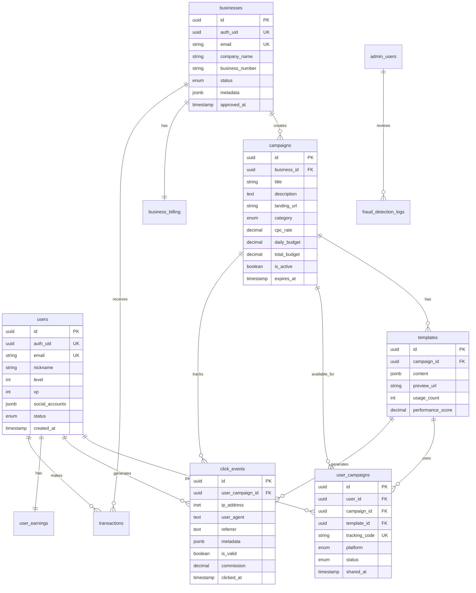

# Treit 데이터베이스 설계

## 📊 ERD (Entity Relationship Diagram)



## 📋 테이블 상세 스키마

### 1. **users** - 사용자 정보

```sql
CREATE TABLE users (
    -- Primary Key
    id UUID PRIMARY KEY DEFAULT gen_random_uuid(),
    
    -- Authentication
    auth_uid UUID UNIQUE NOT NULL REFERENCES auth.users(id) ON DELETE CASCADE,
    email TEXT UNIQUE NOT NULL,
    email_verified BOOLEAN DEFAULT false,
    
    -- Profile
    nickname TEXT NOT NULL,
    phone TEXT,
    phone_verified BOOLEAN DEFAULT false,
    profile_image_url TEXT,
    
    -- Gamification
    level INTEGER NOT NULL DEFAULT 1 CHECK (level >= 1 AND level <= 100),
    xp INTEGER NOT NULL DEFAULT 0 CHECK (xp >= 0),
    total_earnings DECIMAL(12,2) NOT NULL DEFAULT 0 CHECK (total_earnings >= 0),
    
    -- Social Accounts
    social_accounts JSONB DEFAULT '{}',
    /* Example:
    {
        "instagram": {"username": "user123", "verified": true, "followers": 1000},
        "facebook": {"id": "fb123", "verified": false},
        "tiktok": {"username": "tik123", "verified": true}
    }
    */
    
    -- Status
    status user_status NOT NULL DEFAULT 'ACTIVE',
    suspension_reason TEXT,
    suspended_until TIMESTAMPTZ,
    
    -- Metadata
    last_login_at TIMESTAMPTZ,
    login_count INTEGER DEFAULT 0,
    referral_code TEXT UNIQUE,
    referred_by UUID REFERENCES users(id),
    
    -- Timestamps
    created_at TIMESTAMPTZ DEFAULT NOW(),
    updated_at TIMESTAMPTZ DEFAULT NOW()
);

-- Indexes
CREATE INDEX idx_users_status ON users(status) WHERE status = 'ACTIVE';
CREATE INDEX idx_users_level ON users(level DESC);
CREATE INDEX idx_users_referral ON users(referral_code) WHERE referral_code IS NOT NULL;

-- RLS Policies
ALTER TABLE users ENABLE ROW LEVEL SECURITY;

CREATE POLICY "Users can view own profile" ON users
    FOR SELECT USING (auth.uid() = auth_uid);

CREATE POLICY "Users can update own profile" ON users
    FOR UPDATE USING (auth.uid() = auth_uid)
    WITH CHECK (auth.uid() = auth_uid);
```

### 2. **businesses** - 광고주 정보

```sql
CREATE TABLE businesses (
    id UUID PRIMARY KEY DEFAULT gen_random_uuid(),
    
    -- Authentication
    auth_uid UUID UNIQUE NOT NULL REFERENCES auth.users(id) ON DELETE CASCADE,
    email TEXT UNIQUE NOT NULL,
    
    -- Company Info
    company_name TEXT NOT NULL,
    business_number TEXT UNIQUE,
    representative_name TEXT,
    phone TEXT NOT NULL,
    
    -- Address
    address JSONB,
    /* Example:
    {
        "street": "테헤란로 123",
        "city": "서울",
        "state": "서울특별시",
        "postal_code": "12345",
        "country": "KR"
    }
    */
    
    -- Business Details
    industry business_industry,
    company_size company_size,
    website_url TEXT,
    
    -- Verification
    status business_status NOT NULL DEFAULT 'PENDING',
    verified_at TIMESTAMPTZ,
    verified_by UUID REFERENCES admin_users(id),
    rejection_reason TEXT,
    
    -- Documents
    business_license_url TEXT,
    tax_certificate_url TEXT,
    
    -- Metadata
    tags TEXT[],
    notes TEXT,
    
    -- Timestamps
    created_at TIMESTAMPTZ DEFAULT NOW(),
    updated_at TIMESTAMPTZ DEFAULT NOW()
);

-- Indexes
CREATE INDEX idx_businesses_status ON businesses(status);
CREATE INDEX idx_businesses_industry ON businesses(industry);

-- RLS Policies
ALTER TABLE businesses ENABLE ROW LEVEL SECURITY;

CREATE POLICY "Businesses can view own data" ON businesses
    FOR SELECT USING (auth.uid() = auth_uid OR status = 'ACTIVE');

CREATE POLICY "Businesses can update own data" ON businesses
    FOR UPDATE USING (auth.uid() = auth_uid);
```

### 3. **campaigns** - 캠페인 정보

```sql
CREATE TABLE campaigns (
    id UUID PRIMARY KEY DEFAULT gen_random_uuid(),
    business_id UUID NOT NULL REFERENCES businesses(id) ON DELETE CASCADE,
    
    -- Campaign Info
    title TEXT NOT NULL,
    description TEXT,
    landing_page_url TEXT NOT NULL,
    category campaign_category NOT NULL,
    tags TEXT[],
    
    -- Pricing
    cpc_rate DECIMAL(10,2) NOT NULL CHECK (cpc_rate > 0),
    currency TEXT NOT NULL DEFAULT 'KRW',
    
    -- Budget
    daily_budget DECIMAL(12,2) CHECK (daily_budget > 0),
    total_budget DECIMAL(12,2) CHECK (total_budget > 0),
    spent_amount DECIMAL(12,2) NOT NULL DEFAULT 0,
    
    -- Scheduling
    start_date DATE NOT NULL DEFAULT CURRENT_DATE,
    end_date DATE,
    is_active BOOLEAN NOT NULL DEFAULT false,
    paused_at TIMESTAMPTZ,
    
    -- Targeting
    target_demographics JSONB DEFAULT '{}',
    /* Example:
    {
        "age_range": [20, 35],
        "gender": ["male", "female"],
        "locations": ["Seoul", "Busan"],
        "interests": ["fashion", "beauty"]
    }
    */
    
    -- Performance
    total_clicks INTEGER NOT NULL DEFAULT 0,
    total_impressions INTEGER NOT NULL DEFAULT 0,
    ctr DECIMAL(5,2) GENERATED ALWAYS AS (
        CASE 
            WHEN total_impressions > 0 
            THEN (total_clicks::DECIMAL / total_impressions * 100)
            ELSE 0 
        END
    ) STORED,
    
    -- Status
    approval_status approval_status NOT NULL DEFAULT 'PENDING',
    approved_at TIMESTAMPTZ,
    approved_by UUID REFERENCES admin_users(id),
    rejection_reason TEXT,
    
    -- Timestamps
    created_at TIMESTAMPTZ DEFAULT NOW(),
    updated_at TIMESTAMPTZ DEFAULT NOW(),
    deleted_at TIMESTAMPTZ
);

-- Indexes
CREATE INDEX idx_campaigns_business ON campaigns(business_id);
CREATE INDEX idx_campaigns_active ON campaigns(is_active, approval_status) 
    WHERE is_active = true AND approval_status = 'APPROVED';
CREATE INDEX idx_campaigns_category ON campaigns(category);
CREATE INDEX idx_campaigns_dates ON campaigns(start_date, end_date);

-- RLS Policies
ALTER TABLE campaigns ENABLE ROW LEVEL SECURITY;

CREATE POLICY "Public can view active campaigns" ON campaigns
    FOR SELECT USING (is_active = true AND approval_status = 'APPROVED');

CREATE POLICY "Businesses can manage own campaigns" ON campaigns
    FOR ALL USING (
        business_id IN (
            SELECT id FROM businesses WHERE auth_uid = auth.uid()
        )
    );
```

### 4. **templates** - 템플릿 정보

```sql
CREATE TABLE templates (
    id UUID PRIMARY KEY DEFAULT gen_random_uuid(),
    campaign_id UUID NOT NULL REFERENCES campaigns(id) ON DELETE CASCADE,
    
    -- Template Content
    name TEXT NOT NULL,
    content JSONB NOT NULL,
    /* Example:
    {
        "title": "여름 세일 50% 할인!",
        "body": "지금 바로 확인하세요...",
        "image_url": "https://...",
        "cta_text": "구매하기",
        "hashtags": ["#여름세일", "#50%할인"]
    }
    */
    
    -- Preview
    preview_image_url TEXT,
    preview_text TEXT,
    
    -- Performance
    usage_count INTEGER NOT NULL DEFAULT 0,
    click_count INTEGER NOT NULL DEFAULT 0,
    conversion_count INTEGER NOT NULL DEFAULT 0,
    performance_score DECIMAL(5,2) NOT NULL DEFAULT 0,
    
    -- Status
    is_active BOOLEAN NOT NULL DEFAULT true,
    
    -- Timestamps
    created_at TIMESTAMPTZ DEFAULT NOW(),
    updated_at TIMESTAMPTZ DEFAULT NOW()
);

-- Indexes
CREATE INDEX idx_templates_campaign ON templates(campaign_id);
CREATE INDEX idx_templates_performance ON templates(performance_score DESC);

-- RLS Policies
ALTER TABLE templates ENABLE ROW LEVEL SECURITY;

CREATE POLICY "Public can view active templates" ON templates
    FOR SELECT USING (
        is_active = true AND
        campaign_id IN (
            SELECT id FROM campaigns 
            WHERE is_active = true AND approval_status = 'APPROVED'
        )
    );
```

### 5. **user_campaigns** - 사용자-캠페인 매칭

```sql
CREATE TABLE user_campaigns (
    id UUID PRIMARY KEY DEFAULT gen_random_uuid(),
    user_id UUID NOT NULL REFERENCES users(id) ON DELETE CASCADE,
    campaign_id UUID NOT NULL REFERENCES campaigns(id) ON DELETE CASCADE,
    template_id UUID NOT NULL REFERENCES templates(id) ON DELETE CASCADE,
    
    -- Tracking
    tracking_code TEXT UNIQUE NOT NULL DEFAULT generate_tracking_code(),
    share_url TEXT GENERATED ALWAYS AS (
        'https://tre-it.com/t/' || tracking_code
    ) STORED,
    
    -- Platform Info
    platform social_platform NOT NULL,
    platform_post_id TEXT,
    platform_post_url TEXT,
    
    -- Performance
    click_count INTEGER NOT NULL DEFAULT 0,
    earned_amount DECIMAL(10,2) NOT NULL DEFAULT 0,
    
    -- Status
    status matching_status NOT NULL DEFAULT 'ACTIVE',
    
    -- Timestamps
    shared_at TIMESTAMPTZ DEFAULT NOW(),
    completed_at TIMESTAMPTZ,
    
    -- Unique constraint
    UNIQUE(user_id, campaign_id, template_id, platform)
);

-- Function to generate tracking code
CREATE OR REPLACE FUNCTION generate_tracking_code() 
RETURNS TEXT AS $$
BEGIN
    RETURN encode(gen_random_bytes(8), 'hex');
END;
$$ LANGUAGE plpgsql;

-- Indexes
CREATE INDEX idx_user_campaigns_user ON user_campaigns(user_id);
CREATE INDEX idx_user_campaigns_campaign ON user_campaigns(campaign_id);
CREATE INDEX idx_user_campaigns_tracking ON user_campaigns(tracking_code);
CREATE INDEX idx_user_campaigns_status ON user_campaigns(status);

-- RLS Policies
ALTER TABLE user_campaigns ENABLE ROW LEVEL SECURITY;

CREATE POLICY "Users can view own campaigns" ON user_campaigns
    FOR SELECT USING (user_id IN (
        SELECT id FROM users WHERE auth_uid = auth.uid()
    ));

CREATE POLICY "Users can create campaigns" ON user_campaigns
    FOR INSERT WITH CHECK (user_id IN (
        SELECT id FROM users WHERE auth_uid = auth.uid()
    ));
```

### 6. **click_events** - 클릭 이벤트 (파티션 테이블)

```sql
-- 파티션 테이블 생성
CREATE TABLE click_events (
    id UUID DEFAULT gen_random_uuid(),
    user_campaign_id UUID NOT NULL REFERENCES user_campaigns(id),
    
    -- Click Info
    ip_address INET NOT NULL,
    user_agent TEXT,
    referrer_url TEXT,
    device_type device_type,
    browser TEXT,
    os TEXT,
    country_code TEXT,
    
    -- Validation
    is_valid BOOLEAN NOT NULL DEFAULT true,
    validation_score DECIMAL(3,2) DEFAULT 1.0,
    fraud_flags TEXT[],
    
    -- Financial
    commission_amount DECIMAL(10,2) NOT NULL DEFAULT 0,
    
    -- Metadata
    session_id TEXT,
    metadata JSONB DEFAULT '{}',
    
    -- Timestamp
    clicked_at TIMESTAMPTZ NOT NULL DEFAULT NOW(),
    
    -- Partitioning key
    PRIMARY KEY (id, clicked_at)
) PARTITION BY RANGE (clicked_at);

-- 월별 파티션 생성 (예시: 2024년)
CREATE TABLE click_events_2024_01 PARTITION OF click_events
    FOR VALUES FROM ('2024-01-01') TO ('2024-02-01');
    
CREATE TABLE click_events_2024_02 PARTITION OF click_events
    FOR VALUES FROM ('2024-02-01') TO ('2024-03-01');
-- ... 계속

-- 자동 파티션 생성 함수
CREATE OR REPLACE FUNCTION create_monthly_partition()
RETURNS void AS $$
DECLARE
    start_date date;
    end_date date;
    partition_name text;
BEGIN
    start_date := date_trunc('month', CURRENT_DATE);
    end_date := start_date + interval '1 month';
    partition_name := 'click_events_' || to_char(start_date, 'YYYY_MM');
    
    EXECUTE format('CREATE TABLE IF NOT EXISTS %I PARTITION OF click_events 
        FOR VALUES FROM (%L) TO (%L)',
        partition_name, start_date, end_date);
END;
$$ LANGUAGE plpgsql;

-- 매월 자동 실행 (pg_cron 사용)
SELECT cron.schedule('create-monthly-partition', '0 0 1 * *', 'SELECT create_monthly_partition()');

-- Indexes (각 파티션에 자동 상속)
CREATE INDEX idx_click_events_campaign ON click_events(user_campaign_id, clicked_at DESC);
CREATE INDEX idx_click_events_valid ON click_events(is_valid) WHERE is_valid = true;
CREATE INDEX idx_click_events_ip ON click_events(ip_address, clicked_at);

-- 중복 클릭 방지를 위한 유니크 인덱스
CREATE UNIQUE INDEX idx_click_unique ON click_events(
    user_campaign_id, 
    ip_address, 
    date_trunc('minute', clicked_at)
);
```

### 7. **user_earnings** - 사용자 수익

```sql
CREATE TABLE user_earnings (
    user_id UUID PRIMARY KEY REFERENCES users(id) ON DELETE CASCADE,
    
    -- Earnings
    total_earned DECIMAL(12,2) NOT NULL DEFAULT 0,
    pending_amount DECIMAL(12,2) NOT NULL DEFAULT 0,
    available_amount DECIMAL(12,2) NOT NULL DEFAULT 0,
    withdrawn_amount DECIMAL(12,2) NOT NULL DEFAULT 0,
    
    -- This Month
    monthly_earned DECIMAL(12,2) NOT NULL DEFAULT 0,
    monthly_clicks INTEGER NOT NULL DEFAULT 0,
    
    -- Payout Info
    payout_method payout_method,
    payout_account JSONB,
    /* Example:
    {
        "bank_name": "신한은행",
        "account_number": "***-***-******",
        "account_holder": "홍길동"
    }
    */
    
    -- Withdrawal Settings
    auto_withdrawal BOOLEAN DEFAULT false,
    min_withdrawal_amount DECIMAL(10,2) DEFAULT 10000,
    
    -- Last Activities
    last_earned_at TIMESTAMPTZ,
    last_withdrawal_at TIMESTAMPTZ,
    
    -- Timestamps
    updated_at TIMESTAMPTZ DEFAULT NOW()
);

-- Trigger to update monthly stats
CREATE OR REPLACE FUNCTION reset_monthly_earnings()
RETURNS trigger AS $$
BEGIN
    IF date_trunc('month', NEW.updated_at) > date_trunc('month', OLD.updated_at) THEN
        NEW.monthly_earned := 0;
        NEW.monthly_clicks := 0;
    END IF;
    RETURN NEW;
END;
$$ LANGUAGE plpgsql;

CREATE TRIGGER trigger_reset_monthly_earnings
    BEFORE UPDATE ON user_earnings
    FOR EACH ROW
    EXECUTE FUNCTION reset_monthly_earnings();

-- RLS Policies
ALTER TABLE user_earnings ENABLE ROW LEVEL SECURITY;

CREATE POLICY "Users can view own earnings" ON user_earnings
    FOR SELECT USING (user_id IN (
        SELECT id FROM users WHERE auth_uid = auth.uid()
    ));
```

### 8. **business_billing** - 광고주 결제

```sql
CREATE TABLE business_billing (
    business_id UUID PRIMARY KEY REFERENCES businesses(id) ON DELETE CASCADE,
    
    -- Credits
    total_credits DECIMAL(12,2) NOT NULL DEFAULT 0,
    used_credits DECIMAL(12,2) NOT NULL DEFAULT 0,
    remaining_credits DECIMAL(12,2) GENERATED ALWAYS AS (
        total_credits - used_credits
    ) STORED,
    
    -- Spending
    total_spent DECIMAL(12,2) NOT NULL DEFAULT 0,
    monthly_spent DECIMAL(12,2) NOT NULL DEFAULT 0,
    daily_spent DECIMAL(12,2) NOT NULL DEFAULT 0,
    
    -- Auto Recharge
    auto_recharge BOOLEAN DEFAULT false,
    auto_recharge_amount DECIMAL(10,2),
    auto_recharge_threshold DECIMAL(10,2),
    
    -- Payment Method
    default_payment_method JSONB,
    /* Example:
    {
        "type": "card",
        "last4": "1234",
        "brand": "visa",
        "stripe_payment_method_id": "pm_xxx"
    }
    */
    
    -- Billing Info
    billing_email TEXT,
    billing_cycle billing_cycle DEFAULT 'monthly',
    next_billing_date DATE,
    
    -- Timestamps
    last_charged_at TIMESTAMPTZ,
    updated_at TIMESTAMPTZ DEFAULT NOW()
);

-- Daily spending reset
CREATE OR REPLACE FUNCTION reset_daily_spending()
RETURNS void AS $$
BEGIN
    UPDATE business_billing SET daily_spent = 0;
END;
$$ LANGUAGE plpgsql;

-- Schedule daily reset
SELECT cron.schedule('reset-daily-spending', '0 0 * * *', 'SELECT reset_daily_spending()');

-- RLS Policies
ALTER TABLE business_billing ENABLE ROW LEVEL SECURITY;

CREATE POLICY "Businesses can view own billing" ON business_billing
    FOR SELECT USING (business_id IN (
        SELECT id FROM businesses WHERE auth_uid = auth.uid()
    ));
```

### 9. **transactions** - 거래 내역

```sql
CREATE TABLE transactions (
    id UUID PRIMARY KEY DEFAULT gen_random_uuid(),
    
    -- Transaction Type
    type transaction_type NOT NULL,
    category transaction_category NOT NULL,
    
    -- Parties
    user_id UUID REFERENCES users(id),
    business_id UUID REFERENCES businesses(id),
    
    -- Amount
    amount DECIMAL(12,2) NOT NULL,
    currency TEXT NOT NULL DEFAULT 'KRW',
    
    -- Status
    status transaction_status NOT NULL DEFAULT 'PENDING',
    
    -- Payment Info
    payment_method TEXT,
    payment_provider payment_provider,
    provider_transaction_id TEXT,
    
    -- Metadata
    description TEXT,
    metadata JSONB DEFAULT '{}',
    
    -- Timestamps
    created_at TIMESTAMPTZ DEFAULT NOW(),
    completed_at TIMESTAMPTZ,
    failed_at TIMESTAMPTZ,
    
    -- Constraints
    CHECK (
        (type IN ('earning', 'withdrawal') AND user_id IS NOT NULL) OR
        (type IN ('charge', 'refund') AND business_id IS NOT NULL)
    )
);

-- Indexes
CREATE INDEX idx_transactions_user ON transactions(user_id, created_at DESC);
CREATE INDEX idx_transactions_business ON transactions(business_id, created_at DESC);
CREATE INDEX idx_transactions_status ON transactions(status);
CREATE INDEX idx_transactions_provider ON transactions(provider_transaction_id);

-- RLS Policies
ALTER TABLE transactions ENABLE ROW LEVEL SECURITY;

CREATE POLICY "Users can view own transactions" ON transactions
    FOR SELECT USING (
        user_id IN (SELECT id FROM users WHERE auth_uid = auth.uid()) OR
        business_id IN (SELECT id FROM businesses WHERE auth_uid = auth.uid())
    );
```

### 10. **fraud_detection_logs** - 어뷰징 감지 로그

```sql
CREATE TABLE fraud_detection_logs (
    id UUID PRIMARY KEY DEFAULT gen_random_uuid(),
    
    -- Target
    user_id UUID REFERENCES users(id),
    campaign_id UUID REFERENCES campaigns(id),
    click_event_id UUID,
    
    -- Detection
    fraud_type fraud_type NOT NULL,
    confidence_score DECIMAL(3,2) NOT NULL,
    detection_method TEXT,
    
    -- Evidence
    evidence JSONB NOT NULL,
    /* Example:
    {
        "ip_frequency": 50,
        "time_pattern": "suspicious",
        "device_fingerprint": "duplicate",
        "click_velocity": 10.5
    }
    */
    
    -- Action Taken
    action_taken fraud_action,
    action_reason TEXT,
    
    -- Review
    reviewed_by UUID REFERENCES admin_users(id),
    reviewed_at TIMESTAMPTZ,
    review_decision review_decision,
    review_notes TEXT,
    
    -- Timestamps
    detected_at TIMESTAMPTZ DEFAULT NOW()
);

-- Indexes
CREATE INDEX idx_fraud_user ON fraud_detection_logs(user_id);
CREATE INDEX idx_fraud_campaign ON fraud_detection_logs(campaign_id);
CREATE INDEX idx_fraud_type ON fraud_detection_logs(fraud_type);
CREATE INDEX idx_fraud_reviewed ON fraud_detection_logs(reviewed_at) WHERE reviewed_at IS NULL;
```

## 🔧 Enums (열거형)

```sql
-- User related
CREATE TYPE user_status AS ENUM ('ACTIVE', 'INACTIVE', 'SUSPENDED', 'DELETED');
CREATE TYPE social_platform AS ENUM ('INSTAGRAM', 'FACEBOOK', 'TWITTER', 'TIKTOK', 'YOUTUBE', 'BLOG');

-- Business related
CREATE TYPE business_status AS ENUM ('PENDING', 'ACTIVE', 'SUSPENDED', 'REJECTED');
CREATE TYPE business_industry AS ENUM ('RETAIL', 'FOOD', 'BEAUTY', 'FITNESS', 'EDUCATION', 'TECH', 'OTHER');
CREATE TYPE company_size AS ENUM ('SMALL', 'MEDIUM', 'LARGE', 'ENTERPRISE');

-- Campaign related
CREATE TYPE campaign_category AS ENUM ('PRODUCT', 'SERVICE', 'EVENT', 'BRAND', 'APP', 'OTHER');
CREATE TYPE approval_status AS ENUM ('PENDING', 'APPROVED', 'REJECTED');
CREATE TYPE matching_status AS ENUM ('ACTIVE', 'COMPLETED', 'PAUSED', 'CANCELLED');

-- Transaction related
CREATE TYPE transaction_type AS ENUM ('earning', 'withdrawal', 'charge', 'refund');
CREATE TYPE transaction_category AS ENUM ('click', 'bonus', 'referral', 'penalty');
CREATE TYPE transaction_status AS ENUM ('PENDING', 'PROCESSING', 'COMPLETED', 'FAILED', 'CANCELLED');
CREATE TYPE payment_provider AS ENUM ('stripe', 'toss', 'bank_transfer');
CREATE TYPE payout_method AS ENUM ('bank', 'card', 'paypal');

-- Fraud related
CREATE TYPE fraud_type AS ENUM ('click_spam', 'bot_activity', 'ip_farming', 'pattern_anomaly', 'account_farming');
CREATE TYPE fraud_action AS ENUM ('warning', 'suspend_campaign', 'suspend_user', 'block_ip');
CREATE TYPE review_decision AS ENUM ('confirmed', 'false_positive', 'needs_investigation');

-- Other
CREATE TYPE device_type AS ENUM ('mobile', 'tablet', 'desktop', 'bot');
CREATE TYPE billing_cycle AS ENUM ('daily', 'weekly', 'monthly', 'quarterly');
```

## 📊 Views & Materialized Views

### Campaign Performance View

```sql
CREATE MATERIALIZED VIEW mv_campaign_performance AS
SELECT 
    c.id as campaign_id,
    c.business_id,
    c.title,
    c.category,
    c.cpc_rate,
    COUNT(DISTINCT uc.user_id) as unique_users,
    COUNT(ce.id) as total_clicks,
    SUM(CASE WHEN ce.is_valid THEN 1 ELSE 0 END) as valid_clicks,
    SUM(ce.commission_amount) as total_commission,
    AVG(ce.validation_score) as avg_quality_score,
    c.spent_amount,
    c.total_budget,
    (c.total_budget - c.spent_amount) as remaining_budget,
    date_trunc('hour', NOW()) as last_updated
FROM campaigns c
LEFT JOIN user_campaigns uc ON c.id = uc.campaign_id
LEFT JOIN click_events ce ON uc.id = ce.user_campaign_id
WHERE c.is_active = true
GROUP BY c.id;

-- Refresh every hour
CREATE OR REPLACE FUNCTION refresh_campaign_performance()
RETURNS void AS $$
BEGIN
    REFRESH MATERIALIZED VIEW CONCURRENTLY mv_campaign_performance;
END;
$$ LANGUAGE plpgsql;

SELECT cron.schedule('refresh-campaign-performance', '0 * * * *', 'SELECT refresh_campaign_performance()');

-- Index for fast lookup
CREATE UNIQUE INDEX idx_mv_campaign_performance ON mv_campaign_performance(campaign_id);
```

### User Leaderboard View

```sql
CREATE VIEW v_user_leaderboard AS
SELECT 
    u.id,
    u.nickname,
    u.level,
    u.xp,
    ue.monthly_earned,
    ue.monthly_clicks,
    COUNT(DISTINCT uc.campaign_id) as active_campaigns,
    RANK() OVER (ORDER BY ue.monthly_earned DESC) as earnings_rank,
    RANK() OVER (ORDER BY u.level DESC, u.xp DESC) as level_rank
FROM users u
JOIN user_earnings ue ON u.id = ue.user_id
LEFT JOIN user_campaigns uc ON u.id = uc.user_id AND uc.status = 'ACTIVE'
WHERE u.status = 'ACTIVE'
GROUP BY u.id, u.nickname, u.level, u.xp, ue.monthly_earned, ue.monthly_clicks;
```

## 🔨 Functions & Triggers

### Calculate Click Commission

```sql
CREATE OR REPLACE FUNCTION calculate_commission(
    p_user_campaign_id UUID,
    p_is_valid BOOLEAN
) RETURNS DECIMAL AS $$
DECLARE
    v_cpc_rate DECIMAL;
    v_user_level INTEGER;
    v_bonus_rate DECIMAL;
    v_commission DECIMAL;
BEGIN
    -- Get base CPC rate
    SELECT c.cpc_rate INTO v_cpc_rate
    FROM user_campaigns uc
    JOIN campaigns c ON uc.campaign_id = c.id
    WHERE uc.id = p_user_campaign_id;
    
    -- Get user level for bonus calculation
    SELECT u.level INTO v_user_level
    FROM user_campaigns uc
    JOIN users u ON uc.user_id = u.id
    WHERE uc.id = p_user_campaign_id;
    
    -- Calculate level bonus (1% per level above 1)
    v_bonus_rate := 1 + ((v_user_level - 1) * 0.01);
    
    -- Calculate commission
    IF p_is_valid THEN
        v_commission := v_cpc_rate * v_bonus_rate;
    ELSE
        v_commission := 0;
    END IF;
    
    RETURN v_commission;
END;
$$ LANGUAGE plpgsql;
```

### Validate Click

```sql
CREATE OR REPLACE FUNCTION validate_click(
    p_user_campaign_id UUID,
    p_ip_address INET,
    p_user_agent TEXT
) RETURNS BOOLEAN AS $$
DECLARE
    v_last_click_time TIMESTAMPTZ;
    v_click_count INTEGER;
    v_is_valid BOOLEAN := true;
BEGIN
    -- Check for duplicate click from same IP within 1 minute
    SELECT MAX(clicked_at) INTO v_last_click_time
    FROM click_events
    WHERE user_campaign_id = p_user_campaign_id
      AND ip_address = p_ip_address
      AND clicked_at > NOW() - INTERVAL '1 minute';
    
    IF v_last_click_time IS NOT NULL THEN
        v_is_valid := false;
    END IF;
    
    -- Check for excessive clicks from same IP in last hour
    SELECT COUNT(*) INTO v_click_count
    FROM click_events
    WHERE ip_address = p_ip_address
      AND clicked_at > NOW() - INTERVAL '1 hour';
    
    IF v_click_count > 10 THEN
        v_is_valid := false;
    END IF;
    
    -- Check for bot user agents
    IF p_user_agent ILIKE '%bot%' OR p_user_agent ILIKE '%crawler%' THEN
        v_is_valid := false;
    END IF;
    
    RETURN v_is_valid;
END;
$$ LANGUAGE plpgsql;
```

### Update Campaign Spending

```sql
CREATE OR REPLACE FUNCTION update_campaign_spending()
RETURNS TRIGGER AS $$
BEGIN
    IF NEW.is_valid THEN
        -- Update campaign spent amount
        UPDATE campaigns 
        SET spent_amount = spent_amount + NEW.commission_amount
        WHERE id = (
            SELECT campaign_id FROM user_campaigns 
            WHERE id = NEW.user_campaign_id
        );
        
        -- Update business daily spending
        UPDATE business_billing
        SET daily_spent = daily_spent + NEW.commission_amount,
            monthly_spent = monthly_spent + NEW.commission_amount,
            used_credits = used_credits + NEW.commission_amount
        WHERE business_id = (
            SELECT business_id FROM campaigns
            WHERE id = (
                SELECT campaign_id FROM user_campaigns 
                WHERE id = NEW.user_campaign_id
            )
        );
        
        -- Update user earnings
        UPDATE user_earnings
        SET pending_amount = pending_amount + NEW.commission_amount,
            monthly_earned = monthly_earned + NEW.commission_amount,
            monthly_clicks = monthly_clicks + 1,
            last_earned_at = NOW()
        WHERE user_id = (
            SELECT user_id FROM user_campaigns 
            WHERE id = NEW.user_campaign_id
        );
        
        -- Update user campaign stats
        UPDATE user_campaigns
        SET click_count = click_count + 1,
            earned_amount = earned_amount + NEW.commission_amount
        WHERE id = NEW.user_campaign_id;
    END IF;
    
    RETURN NEW;
END;
$$ LANGUAGE plpgsql;

CREATE TRIGGER trigger_update_spending
    AFTER INSERT ON click_events
    FOR EACH ROW
    EXECUTE FUNCTION update_campaign_spending();
```

## 🔐 Row Level Security (RLS) Policies

### 종합 RLS 정책 매트릭스

| 테이블 | SELECT | INSERT | UPDATE | DELETE |
|--------|--------|--------|--------|--------|
| users | 본인 | 시스템 | 본인 | 불가 |
| businesses | 활성/본인 | 시스템 | 본인 | 불가 |
| campaigns | 활성/소유자 | 소유자 | 소유자 | 소유자 |
| templates | 활성 | 소유자 | 소유자 | 소유자 |
| user_campaigns | 본인 | 본인 | 불가 | 불가 |
| click_events | 불가 | 시스템 | 불가 | 불가 |
| user_earnings | 본인 | 시스템 | 시스템 | 불가 |
| business_billing | 본인 | 시스템 | 시스템 | 불가 |
| transactions | 본인 | 시스템 | 불가 | 불가 |

## 🚀 성능 최적화 전략

### 1. 파티셔닝
- `click_events`: 월별 파티션으로 대용량 데이터 처리
- 오래된 파티션 자동 삭제 (6개월 이상)

### 2. 인덱싱 전략
- 복합 인덱스: 자주 함께 사용되는 컬럼
- 부분 인덱스: WHERE 조건이 있는 인덱스
- BRIN 인덱스: 시계열 데이터

### 3. Materialized Views
- 집계 데이터 캐싱
- 정기적 리프레시 (cron)
- CONCURRENTLY 옵션으로 무중단 업데이트

### 4. 쿼리 최적화
```sql
-- Bad
SELECT * FROM click_events WHERE DATE(clicked_at) = '2024-01-01';

-- Good
SELECT * FROM click_events 
WHERE clicked_at >= '2024-01-01' AND clicked_at < '2024-01-02';
```

## 📦 백업 & 복구

### 백업 전략
```bash
# Daily backup
pg_dump -Fc -d treit_production > backup_$(date +%Y%m%d).dump

# Point-in-time recovery setup
archive_mode = on
archive_command = 'test ! -f /backup/archive/%f && cp %p /backup/archive/%f'
```

### 복구 절차
```bash
# Restore from backup
pg_restore -d treit_production backup_20240101.dump

# Point-in-time recovery
recovery_target_time = '2024-01-01 12:00:00'
```

## 📊 모니터링

### 주요 모니터링 지표
```sql
-- Slow queries
SELECT * FROM pg_stat_statements 
WHERE mean_exec_time > 1000 
ORDER BY mean_exec_time DESC;

-- Table sizes
SELECT schemaname, tablename, 
       pg_size_pretty(pg_total_relation_size(schemaname||'.'||tablename)) as size
FROM pg_tables 
ORDER BY pg_total_relation_size(schemaname||'.'||tablename) DESC;

-- Index usage
SELECT schemaname, tablename, indexname, idx_scan
FROM pg_stat_user_indexes
ORDER BY idx_scan;
```

---

이 데이터베이스 설계는 Treit 시스템의 모든 요구사항을 충족하며, 확장성과 성능을 고려하여 설계되었습니다.